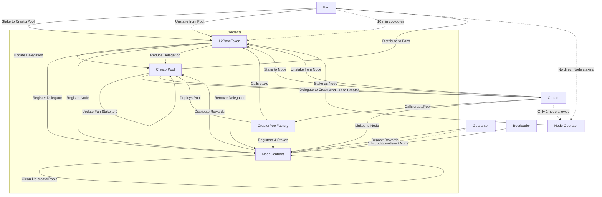
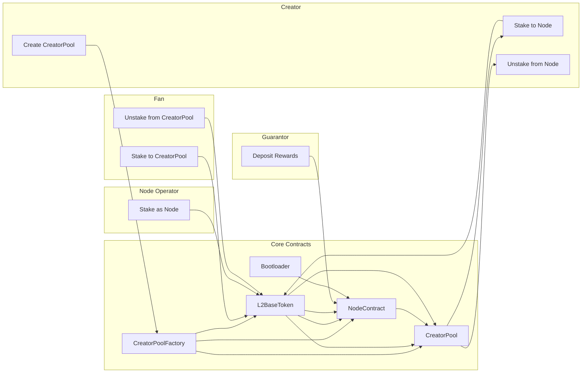

Flowchart

```mermaid
flowchart TD
  %% Participants
  Fan[Fan]
  Creator[Creator]
  Node[Node Operator]
  Guarantor[Guarantor]

  %% Core Contracts
  subgraph Contracts
    L2[L2BaseToken]
    NC[NodeContract]
    CPF[CreatorPoolFactory]
    CP[CreatorPool]
  end

  %% Creator Pool Deployment
  Creator -->|Calls createPool| CPF
  CPF -->|Deploys Pool| CP
  CPF -->|Registers & Stakes| NC
  CPF -->|Calls stake| L2

  %% Fan Staking Flow
  Fan -->|Stake to CreatorPool| L2
  L2 -->|Update Delegation| CP
  CP -->|Track Fan Stake| CP
  CP -->|Delegate to Creator| Creator
  Creator -->|Linked to Node| NC
  NC -->|Increase Delegation| NC

  %% Creator Node Registration
  Creator -->|Stake to Node| L2
  L2 -->|Register Delegator| NC
  NC -->|Evict Weakest if Full| NC

  %% Node Operator Registration
  Node -->|Stake as Node| L2
  L2 -->|Register Node| NC

  %% Reward Distribution
  Guarantor -->|Deposit Rewards| NC
  Bootloader[Bootloader] -->|Select Node| NC
  NC -->|Emit NodeSelected| NC
  NC -->|Distribute Rewards| CP
  CP -->|Send Cut to Creator| Creator
  CP -->|Distribute to Fans| Fan

  %% Unstaking
  Fan -->|Unstake from Pool| L2
  L2 -->|Reduce Delegation| CP
  CP -->|Update Fan Stake to 0| CP

  Creator -->|Unstake from Node| L2
  L2 -->|Remove Delegation| NC
  NC -->|Clean Up creatorPools| NC

  %% Cooldowns & Rules
  Fan -.->|10 min cooldown| L2
  Guarantor -.->|1 hr cooldown| NC
  Fan -.->|No direct Node staking| Node
  Creator -.->|Only 1 node allowed| Node

```

Swimlane-style

```mermaid
flowchart LR
  %% Define swimlanes
  subgraph Fan [Fan]
    F1[Stake to CreatorPool]
    F2[Unstake from CreatorPool]
  end

  subgraph Creator [Creator]
    C1[Create CreatorPool]
    C2[Stake to Node]
    C3[Unstake from Node]
  end

  subgraph Node [Node Operator]
    N1[Stake as Node]
  end

  subgraph Guarantor [Guarantor]
    G1[Deposit Rewards]
  end

  subgraph Contracts [Core Contracts]
    CPF[CreatorPoolFactory]
    CP[CreatorPool]
    L2[L2BaseToken]
    NC[NodeContract]
    BL[Bootloader]
  end

  %% Flows
  C1 --> CPF
  CPF --> CP
  CPF --> L2
  CPF --> NC

  F1 --> L2 --> CP
  CP --> C2
  C2 --> L2 --> NC

  N1 --> L2 --> NC

  G1 --> NC
  BL --> NC
  NC --> CP
  CP --> C3
  F2 --> L2 --> CP

```
